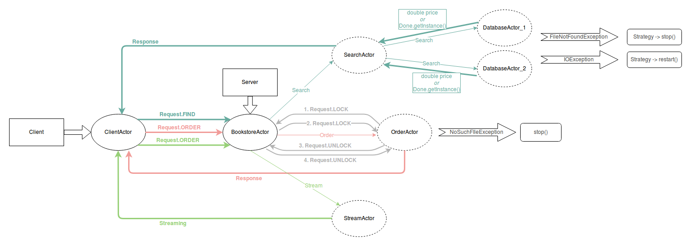

## Akka

### Online bookstore model

Our task is to provide 3 types of operations for users:

- searching for a book (which returns its price or information that it is not available)
- ordering a book (which returns a confirmation of the order)
- streaming a book's text (with a speed of one line/sentence per second)

Console application was created based on Akka platform. Server is a single machine that has multiple resources (but not infinite). It was designed to be able to serve in parallel as many clients as possible (using one server) and to minimalise times of the server's responses. Moreover, the aim was also to minimalise the quantity of data sent via network. 

**Searching for a book**

Having two databases, both of them need to be searched. Database is represented as a text file which, for every book, contains one line, the title and the price. It is possible that both databases might be temporarily unavailable, and that searching through any of them is time-consuming. We assume that if a book is present in both databases it has the same price.

**Ordering a book**

Ordering a book is done by writing new line with the book's title to the orders.txt file, which is a database for orders, and sending a confirmation to the client.

**A book's text streaming**

The client sends the title, and the server's response is a stream of lines or sentences from a file that has a name the same as the book's title.

